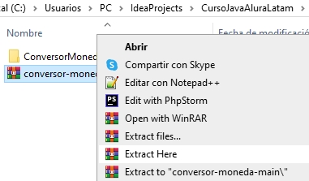

<h1>:heavy_dollar_sign: Conversor de Monedas :heavy_dollar_sign:</h1>

https://github.com/user-attachments/assets/daef0381-938d-4002-b256-6b6d03e46106

# Insignias

    
    
    
    

# Índice

- [Insignias](#insignias)

- [Descripción del proyecto](#descripción-del-proyecto)

- [Estado del proyecto](#estado-del-proyecto)

- [Demostración de funcionalidades](#demostración-de-funcionalidades)

    - [Funcionalidades del proyecto](#funcionalidades-del-proyecto)

    - [Uso del proyecto](#uso-del-proyecto)

- [Acceso al proyecto](#acceso-al-proyecto)

- [Teconologías utilizadas](#teconologías-utilizadas)

- [Personas Desarrolladoras del Proyecto](#persona-desarrolladora-del-proyecto)

# Descripción del proyecto

¡Bienvenido/a al Conversor de Monedas!
Este proyecto permite convertir un tipo de moneda por otro tipo de moneda, teniendo varios tipos de monedas.

# Estado del proyecto

:white_check_mark: Proyecto compleado

# Demostración de funcionalidades

## Funcionalidades del proyecto

- `Funcionalidad 1`: Tiene una conexión con la API de la página Exchange Rates para extraer el valor monetario del tipo de moneda.
- `Funcionalidad 2`: Contiene seis opciones para realizar conversiones de una moneda con otras monedas internacionales.
- `Funcionalidad 3`: Muestra como resultado los dos tipos de monedas seleccionada, el monto introducido y la cantidad convertida.

## Uso del proyecto

Las monedas que contiene el proyecto son: Dólar, Peso Argentino, Real Brasileño y Peso Colombiano.

Al iniciar el programa muestra un menú con seis opciones para convertir el dólar a diferentes tipos de monedas y una opción para finalizar el programa. Para seleccionar una opción se introduce un número.

Cuando se selecciona la primera opción muestra un mensaje indicando que se seleccionó la opción (número introducido y con los dos tipos de monedas). Luego muestra otro mensaje indicando de introducir un monto para convertir.

Por ejemplo al selecciona la opción 1.

Al final muestra un mensaje mostrando el monto introducido y la cantidad convertida. Y otra vez muestra el menú con las opciones.

Y si se selecciona la opción 7 te muestra el siguiente mensaje y finaliza el programa:

# Acceso al proyecto

Para poder usar el proyecto revisar las siguientes dos opciones.

Si no tienes instalado Git realiza lo siguiente:

- Das click en Code, luego click en Download ZIP y se descarga automáticamente el proyecto.

- Arrastra el .ZIP al IDE donde tienes los proyectos realizados (en Apache NetBeans, InelliJ IDEA, etc.).
- Seleccionas el proyecto y le das click en extract here o extraer aquí. Y al final eliminas el .ZIP.

Si tienes instalado Git realiza lo siguiente:

- Das click en Code, luego click en donde están los dos cuadros y se copia en tu portapapeles la url.

- Abres la terminal Git Bash, introduce `git clone` y la ruta (con las diagonales invertidas) donde se clonará el repositorio junto con el proyecto, pegas la url copiada, le das enter y se clona todo.

Para abrir dicho proyecto en IntelliJ IDEA realiza lo siguiente:

- Abrir IntelliJ IDEA y das click en Open o Abrir

- Seleccionar el proyecto, das click en el botón azul OK y se abre.

- Obtener una key o una clave para que funcione el programa. Para eso hay que ir a la página [ExchangeRate-API](https://www.exchangerate-api.com/):

Introduce un correo y luego le mandará a una pestaña para introducir una contraseña para así crear una cuenta y le entreguen la clave. Después te llegará un correo para confirmar dicho correo y le das click al enlace, luego llenas la información que te indiquen, después te llegará otro correo indicando que fue activada tu cuenta y te entregarán la clave la cual sólo lo podrás usar tú.

- Y para arrancar el programa solo le das click en la flecha verde hasta arriba y listo.

# Teconologías utilizadas

- IntelliJ IDEA
- Java JDK 19
- Gson 2.1.1
- Exchange Rates API

# Persona Desarrolladora del Proyecto

[ Sergio Zuñiga Fraga](https://github.com/SergioZF09)

# Agradecimientos

Agradezco a los Maestros Genesys Rondon y al Maestro Bruno Darío Fernandez Ellerbach de Alura Latam junto con Apple por haber hecho un reto increíble y en donde pude aplicar todo lo aprendido en la primera formación de Java.
